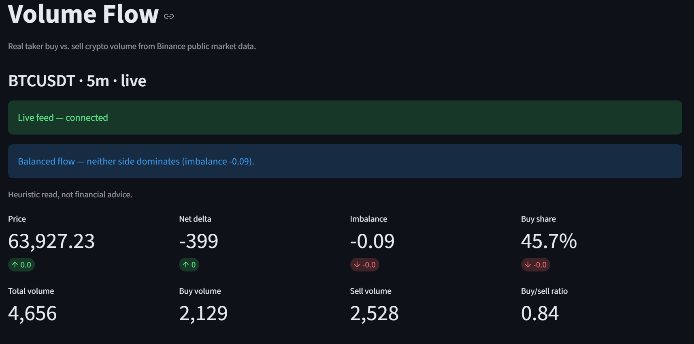
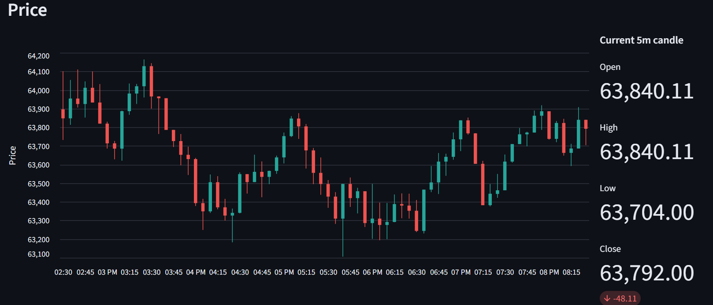
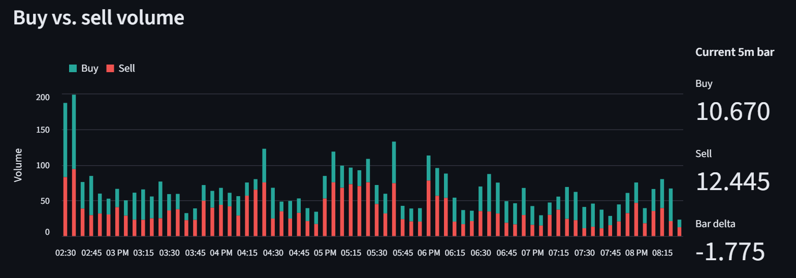
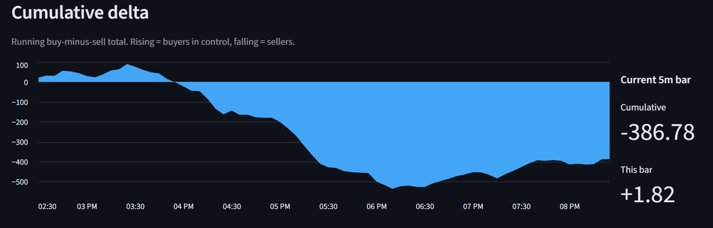

# volume-flow-crypto

A local tool for seeing the real buy-side vs. sell-side split of crypto trading volume,
built on Binance public market data.

Most volume charts show a single bar per candle. This tool splits that volume into the part
driven by **takers buying** (lifting the ask) and the part driven by **takers selling**
(hitting the bid), so you can read order-flow pressure instead of just total turnover.

## How the buy/sell split is computed

Binance kline data includes **taker buy base volume** as a first-class field. Every trade
has a taker side, so taker sell volume is just the remainder:

```
buy_volume  = taker buy base volume          (reported by Binance)
sell_volume = total volume - taker buy base volume
```

This is real order-flow data, not an approximation or a reconstructed estimate.

## Data source

Market data comes from `data-api.binance.vision`, Binance's public market-data host. It needs
no API key and serves the same global market data over plain HTTP.

The usual `api.binance.com` endpoint (and the `python-binance` client that wraps it) is
geo-restricted in my region, so this tool talks to `data-api.binance.vision` directly with
`requests` instead. It is not subject to those regional restrictions.

## Requirements

- Python 3.11+
- [uv](https://docs.astral.sh/uv/)

## How to run

From the project root:

1. Install dependencies. This creates the virtual environment and pulls everything,
   including a matching Python if you don't have one:

   ```bash
   uv sync
   ```

2. Launch the dashboard:

   ```bash
   uv run streamlit run src/volume_flow/app/dashboard.py
   ```

   Streamlit opens the app in your browser at `http://localhost:8501`.

From the sidebar you choose:

- **Symbol** — any Binance spot pair, e.g. `BTCUSDT`, `ETHUSDT`, `SOLUSDT`.
- **Interval** — `1m`, `5m`, `15m`, `1h`, `4h`, or `1d`.
- **Bars (lookback)** — how many recent bars to pull.
- **Live feed** — off by default (poll-on-refresh); toggle on for a live websocket stream.

The page then shows, for that window:

- A **metrics panel**: total / buy / sell volume, buy share, order-flow imbalance,
  buy/sell ratio, net delta, and the latest bar's relative volume.
- **Heuristic flags** calling out buy- or sell-side imbalance and above-average volume.
- A **price candlestick** chart and a **buy/sell volume** chart with a cumulative-delta line.

By default data is fetched on demand (poll-on-refresh), so changing an input refetches and
redraws.

### Live feed

Turn on the **Live feed** toggle to stream the trade feed over Binance's websocket
(`data-stream.binance.vision`, the un-geoblocked websocket counterpart of the REST host). The
window is seeded once from REST history, then every trade is folded into the forming bar, so
the candle and volume move fluidly in real time rather than in slow steps. A connection-status
line shows connected / reconnecting / error; the stream reconnects on its own after a dropped
connection and stops itself if you leave or close the tab. Toggle the switch off to return to
the poll-on-refresh view.

Each trade's taker side comes from Binance's maker flag — the same classification used to
compute kline taker-buy volume — so the live buy/sell split is real order flow. A bar is exact
once it has rolled over and been built entirely from trades; the first seeded bar can differ by
a negligible amount of volume traded in the moment between the REST snapshot and the stream
connecting.

## Screenshots

Header with live metrics and the buy/sell direction read:



Price candles, stacked buy vs. sell volume, and cumulative delta — each with a live
current-bar stats panel:







## Programmatic use

```python
from volume_flow.models import Symbol
from volume_flow.providers.binance import BinanceProvider

provider = BinanceProvider()
bars = provider.get_volume_bars(Symbol("BTCUSDT"), "1h", limit=24)

latest = bars[-1]
print(latest.open_time, "buy:", latest.buy_volume, "sell:", latest.sell_volume)
```

## Development

```bash
uv run pytest
uv run mypy --strict src
```

Tests run fully offline against a recorded market-data fixture; the suite never touches the
network.

## Architecture

- `providers/` — all network I/O (the REST client and the websocket streaming client).
- `metrics/` — pure volume math, no I/O.
- `live.py` — pure logic aggregating live trades into the forming bar and merging onto history.
- `app/` — the Streamlit presentation layer.

## Limitations & delays

Being upfront about what this tool is and isn't:

- **Poll-on-refresh by default.** With the live feed off, data updates only when you change an
  input or rerun the page, so the view can be seconds to minutes stale. The optional **Live
  feed** toggle streams every trade and updates the forming bar in real time.
- **Responses are cached for 60 seconds (poll mode).** In poll mode, re-running with the same
  symbol, interval, and lookback inside that window returns cached data; live mode seeds and
  reseeds from a fresh request instead.
- **The latest bar is incomplete.** The most recent bar is still forming until its interval
  closes, so its volume, imbalance, and relative-volume reading are partial and will move.
- **Lookback is capped at 1000 bars.** That's the per-request limit of the Binance klines
  endpoint; the tool makes a single request and does not paginate further history.
- **Taker-initiated flow only.** The split is taker buy vs. taker sell volume. It reflects who
  crossed the spread, not resting maker liquidity, and it is not a full order-book reconstruction.
- **Spot only, one venue.** Binance spot pairs from `data-api.binance.vision`. No futures,
  options, or other exchanges.
- **Public, unauthenticated host.** `data-api.binance.vision` has no API key, no SLA, and is
  subject to rate limits and occasional downtime. Heavy or rapid use can hit those limits, and
  any fetch failure surfaces as an in-app error rather than crashing.
- **No persistence.** Nothing is stored; every load refetches and recomputes from scratch.

## Disclaimer

This tool is for market analysis and education. Any signal flags it surfaces are heuristics,
not financial advice.
