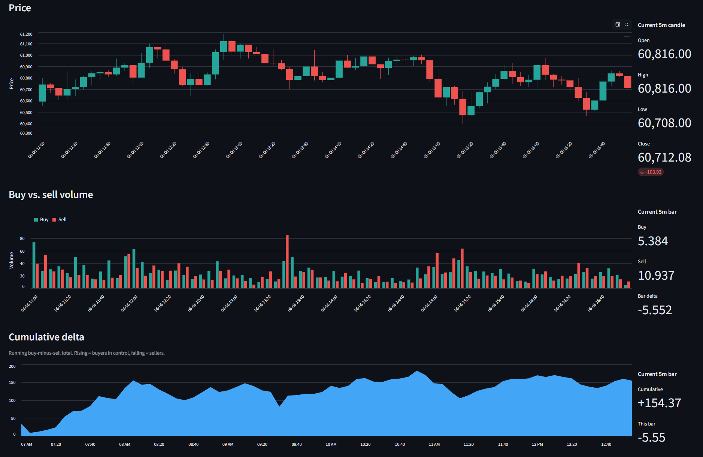

# volume-flow-crypto

A local tool for seeing the real buy-side vs. sell-side split of crypto trading volume,
built on Binance public market data.

Most volume charts show a single bar per candle. This tool splits that volume into the part
driven by **takers buying** (lifting the ask) and the part driven by **takers selling**
(hitting the bid), so you can read order-flow pressure instead of just total turnover.

## How the buy/sell split is computed

Binance kline data includes **taker buy base volume** as a first-class field. Every trade
has a taker side, so taker sell volume is just the remainder:

```
buy_volume  = taker buy base volume          (reported by Binance)
sell_volume = total volume - taker buy base volume
```

This is real order-flow data, not an approximation or a reconstructed estimate.

## Data source

Market data comes from `data-api.binance.vision`, Binance's public market-data host. It needs
no API key and serves the same global market data over plain HTTP.

The usual `api.binance.com` endpoint (and the `python-binance` client that wraps it) is
geo-restricted in my region, so this tool talks to `data-api.binance.vision` directly with
`requests` instead. It is not subject to those regional restrictions.

## Requirements

- Python 3.11+
- [uv](https://docs.astral.sh/uv/)

## Setup

```bash
uv sync
```

## Run the dashboard

```bash
uv run streamlit run src/volume_flow/app/dashboard.py
```

This opens the app in your browser. From the sidebar you choose:

- **Symbol** — any Binance spot pair, e.g. `BTCUSDT`, `ETHUSDT`, `SOLUSDT`.
- **Interval** — `1m`, `5m`, `15m`, `1h`, `4h`, or `1d`.
- **Bars (lookback)** — how many recent bars to pull.

The page then shows, for that window:

- A **metrics panel**: total / buy / sell volume, buy share, order-flow imbalance,
  buy/sell ratio, net delta, and the latest bar's relative volume.
- **Heuristic flags** calling out buy- or sell-side imbalance and above-average volume.
- A **price candlestick** chart and a **buy/sell volume** chart with a cumulative-delta line.

Data is fetched on demand (poll-on-refresh), so changing an input refetches and redraws.

<!-- Drop a screenshot at docs/dashboard.png and uncomment:

-->

## Programmatic use

```python
from volume_flow.models import Symbol
from volume_flow.providers.binance import BinanceProvider

provider = BinanceProvider()
bars = provider.get_volume_bars(Symbol("BTCUSDT"), "1h", limit=24)

latest = bars[-1]
print(latest.open_time, "buy:", latest.buy_volume, "sell:", latest.sell_volume)
```

## Development

```bash
uv run pytest
uv run mypy --strict src
```

Tests run fully offline against a recorded market-data fixture; the suite never touches the
network.

## Architecture

- `providers/` — all network I/O (the Binance client).
- `metrics/` — pure volume math, no I/O.
- `app/` — the Streamlit presentation layer.

## Disclaimer

This tool is for market analysis and education. Any signal flags it surfaces are heuristics,
not financial advice.
